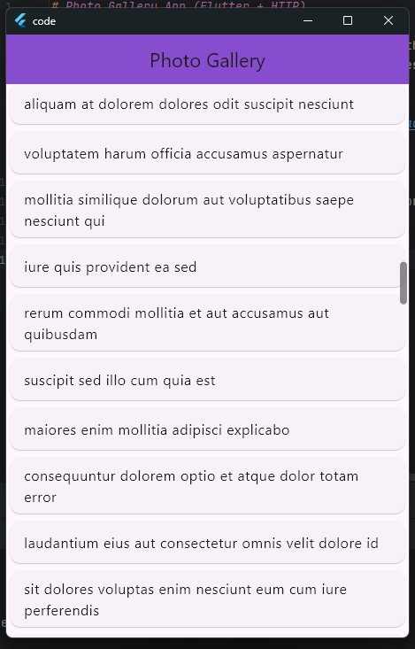

# Photo Gallery App (Flutter + HTTP)

A simple Flutter app that fetches photo data from the JSONPlaceholder API and displays it in a scrollable list.  
This project was built for practice with HTTP requests, JSON parsing, and state management in Flutter.

## Features
- Fetch data from [JSONPlaceholder](https://jsonplaceholder.typicode.com/photos)
- Display photo titles in a scrollable `ListView`
- Loading indicator while fetching data
- Error handling for failed requests
- Uses a custom `Photo` model with `fromJson` factory constructor

## Screenshot
